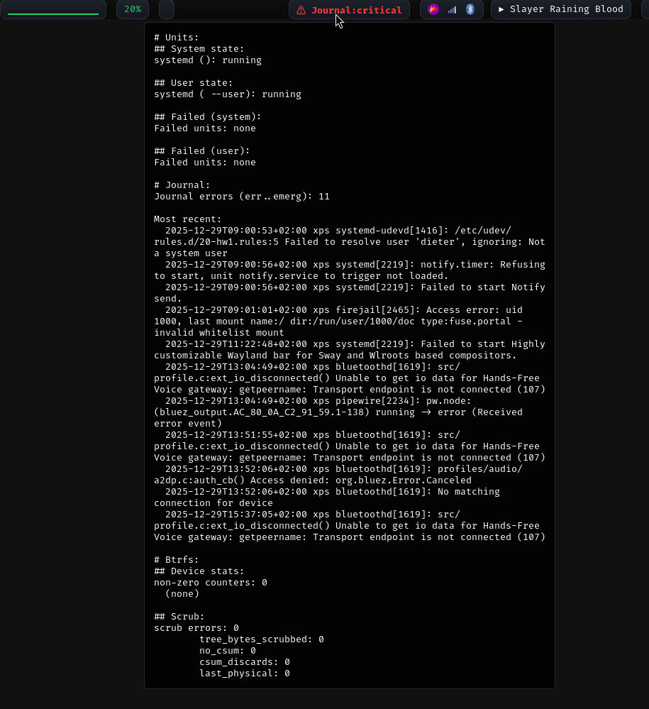

# waybar-system-health

Script for waybar to detect problems with your Linux system.

* If all is well, takes up only a single character: `✓`.
* If there are problems, tells you concisely, with all the details in the tooltip.

If you found yourself previously using waybar modules like `systemd-failed-units` or `disk` and thinking "why do these need to appear in my waybar when everything is fine?", then maybe this is for you.

## Currently supported
- Disk: configurable mountpoint capacity thresholds
- Btrfs: device stats and scrub errors
- systemd: overall status and unit failures
- journal: errors

## More things to add in the future
- old pacnew/pacsave files
- outdated system

## Screenshots
### If status is OK


### If status is Critical



## Configuration

You can include per-module ignore rules in a file at `$XDG_CONFIG_HOME/waybar-system-health/ignore`.
(if you don't know what `$XDG_CONFIG_HOME` is, it's usually `~/.config`)
e.g. something like this:
```
# Ignore noisy firmware/ACPI messages (common on many laptops)
journal:ACPI (Error|BIOS Error)
journal:ucsi_acpi .* (unknown error|UCSI_GET_PDOS failed)
# Ignore basically empty line
journal:kernel: 

# Intel VMD (00:0e.0) sometimes triggers a harmless AHCI probe failure; VMD driver is used.
journal:\bahci\s+0000:00:0e\.0:\s+probe with driver ahci failed with error -12\b
```

## Disk configuration

Mountpoints and thresholds are configured via a JSON file at `$XDG_CONFIG_HOME/waybar-system-health/disk.json`
(overridable with `WAYBAR_SYSTEM_HEALTH_DISK`). The file contains a list of objects:
```
[
  {
    "path": "/",
    "warn": 80,
    "critical": 90
  },
  {
    "path": "/home",
    "warn": 85,
    "critical": 95
  }
]
```
Values are percentages of used space; `warn` cannot exceed `critical`. When the config is missing an entry, the Disk module will emit a warning reminding you to configure it.
## Waybar configuration
Something like...
```
  "custom/system-health": {
  "exec": "~/code/waybar-system-health/waybar-system-health.py",
  "return-type": "json",
  "interval": 30,
  "format": "{}",
  "tooltip": true
},
```
```
#custom-system-health.critical {
    color: red;
    font-weight: bolder;
}
#custom-system-health.ok {
    color: green;
}
#custom-system-health.warning {
    color: yellow;
    font-weight: bolder;
}
```
